# 6 Feb

## Array Type

1. Nothing

## Any Type

1. Json.parse return any type
2. fetch request return any type
3. Don't use any it shuts down all the benefits of typescript

## Object Type

1. Here how we give types to object
   
2. How to add optional properties inside the object
   

## Types vs interfaces

1. We can give the reusable type 'Type' like this
   
2. Interface can only be used with objects
3. Here how we can define the interfaces
   

## Defining Functions

1. If we pass directly an object with extra properties then typescript will throw an error however if you pass it like this(attached) then typescript will not throw error because typescript care about structure only.
   

## Destructured and Rest Parameters

1. Here we can destructured the properties from the functions
   

2. Final output
   

3. Here how we used rest operator
   

## Typing Variables as function

1. This is how we defined function type when passed as arguments
   

# 7 Feb

## Unions

1. Here how can we define the unions
   
2. Some more example using unions
   

## Intersections

1. This is how we do intersections
   
2. This is how we do intersections with types
   

# 8 Feb

## Read Only

1. Here how we use read only on simple properties
   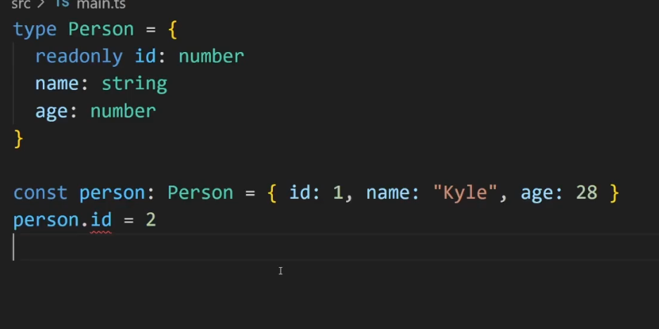
2. This is how we can define read only on array
   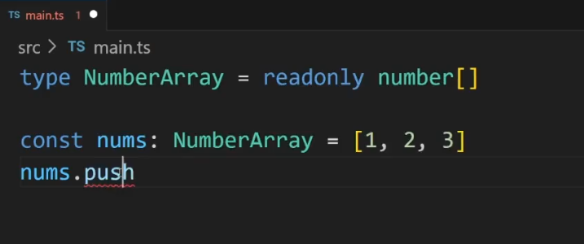

## KeyOF

1. This is how we use key of operator
   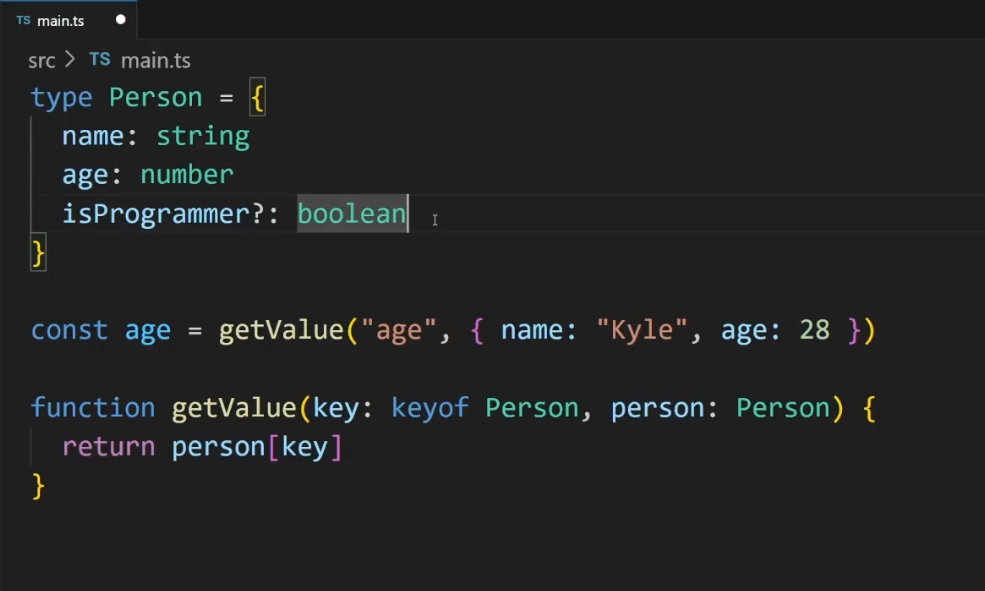

## TypeOF

1. This is how we use typeof operator
   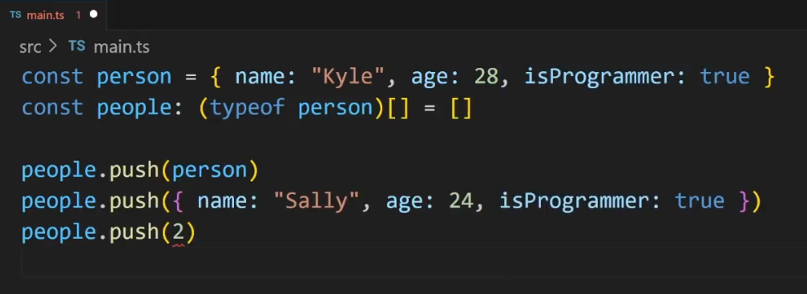
2. People type will be dependent on person type

## Index type

1. This is initial code
   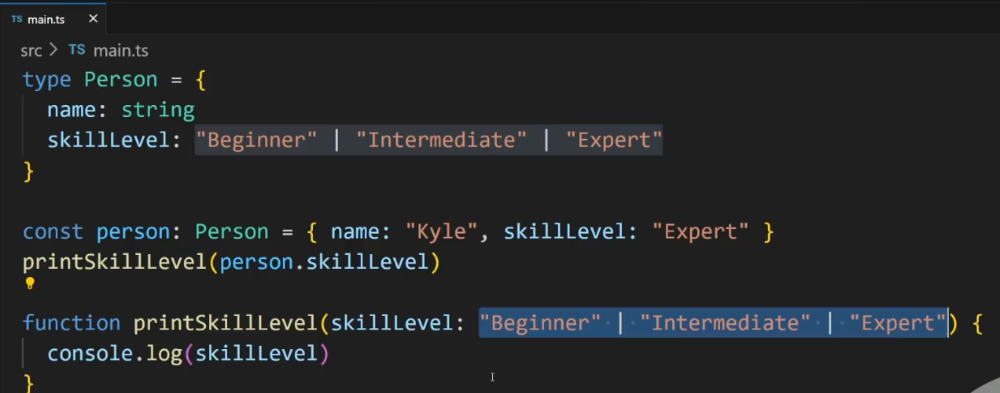
2. We are duplicating the skill level in mutliple places.
3. We can extract out Skill level in new type but we can handle it differently.
4. Here is the way we can solve this
   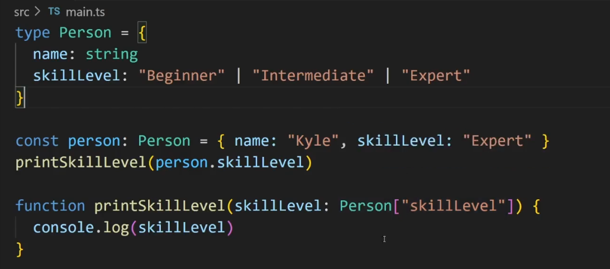
5. Here is another example
   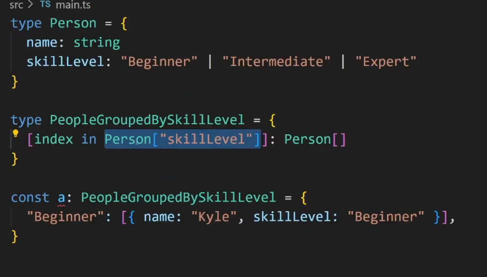

6. Here is another example. in this example we map over each element and return the type of element.
   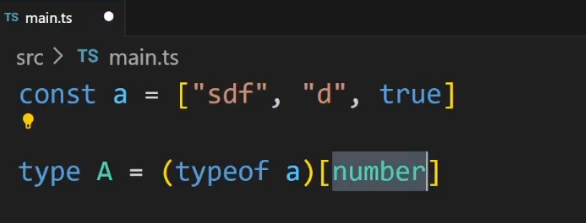

7. Here is another example
   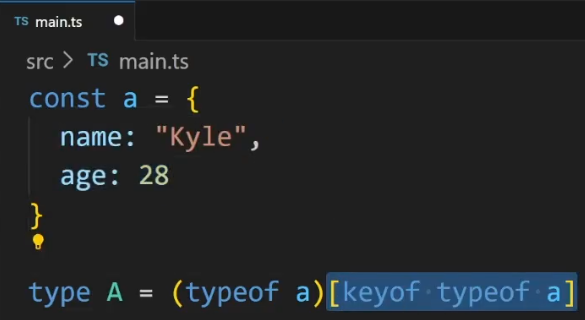

## As const and enums

1. Here we can use as const
   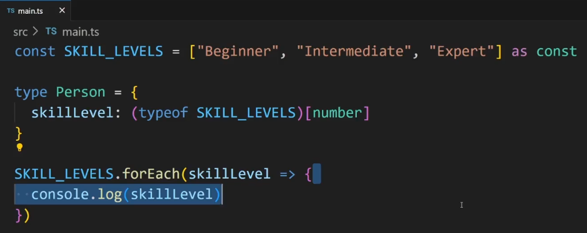

## Tuples

1. This is how we define tuple
   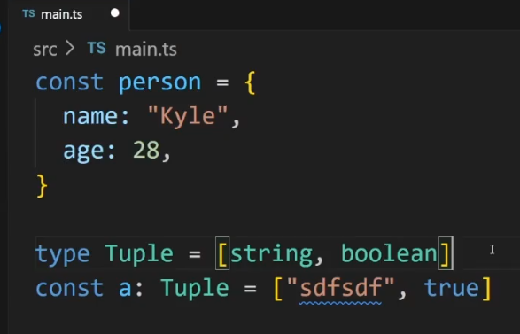
