# 6 Feb

## Array Type

1. Nothing

## Any Type

1. Json.parse return any type
2. fetch request return any type
3. Don't use any it shuts down all the benefits of typescript

## Object Type

1. Here how we give types to object
   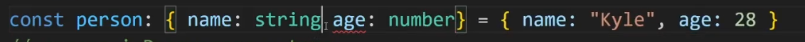
2. How to add optional properties inside the object
   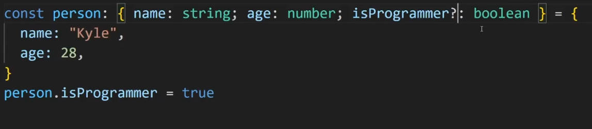

## Types vs interfaces

1. We can give the reusable type 'Type' like this
   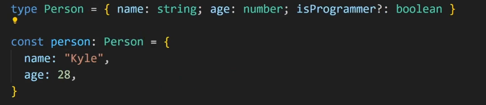
2. Interface can only be used with objects
3. Here how we can define the interfaces
   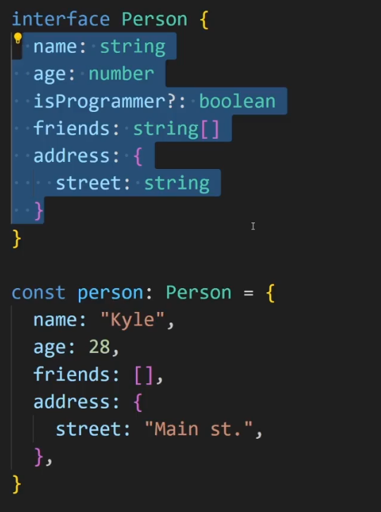

## Defining Functions

1. If we pass directly an object with extra properties then typescript will throw an error however if you pass it like this(attached) then typescript will not throw error because typescript care about structure only.
   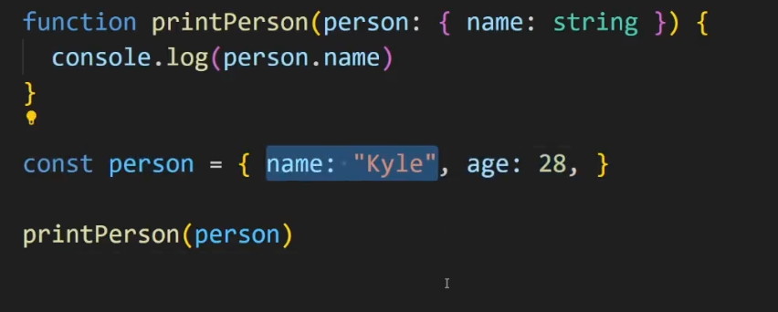

## Destructured and Rest Parameters

1. Here we can destructured the properties from the functions
   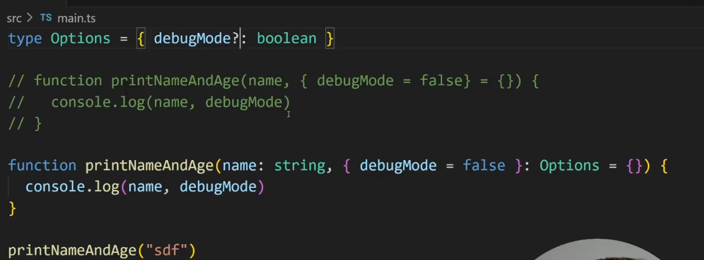

2. Final output
   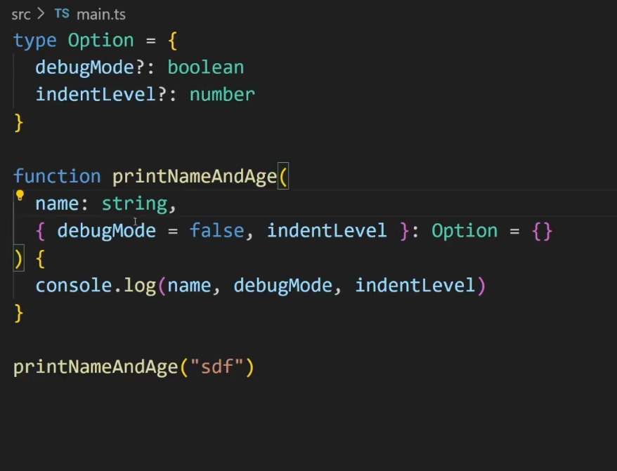

3. Here how we used rest operator
   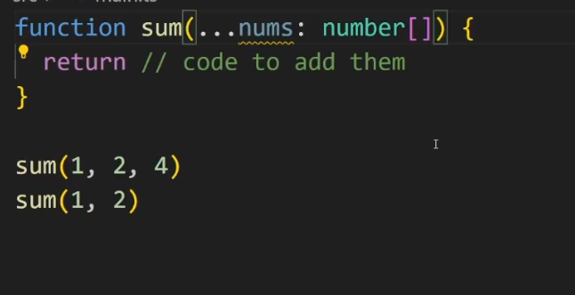

## Typing Variables as function

1. This is how we defined function type when passed as arguments
   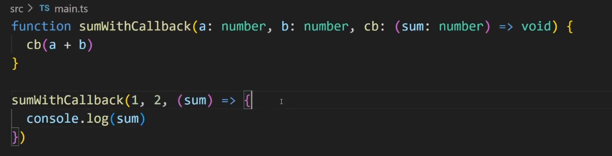

# 7 Feb

## Unions

1. Here how can we define the unions
   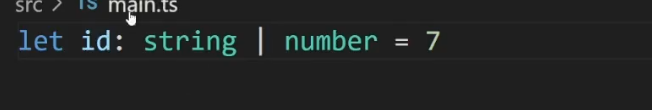
2. Some more example using unions
   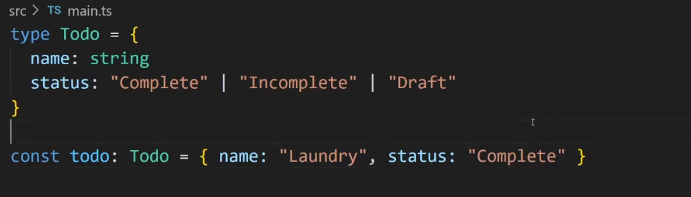

## Intersections

1. This is how we do intersections
   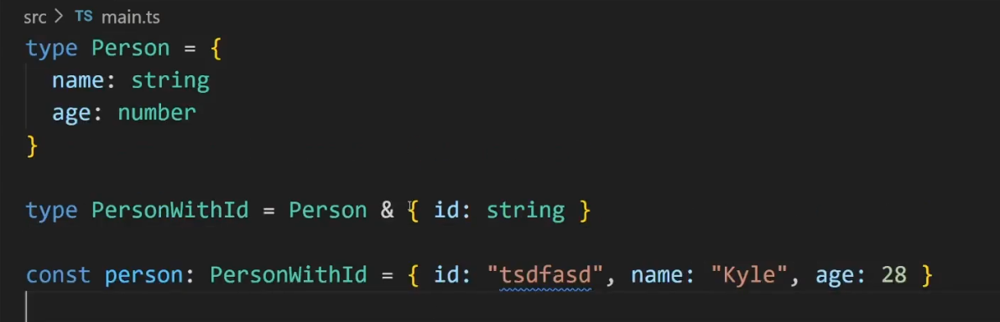
2. This is how we do intersections with types
   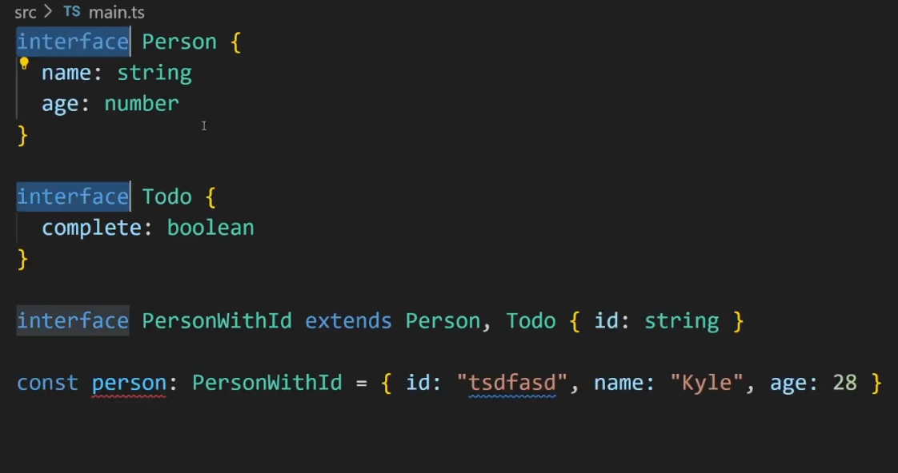