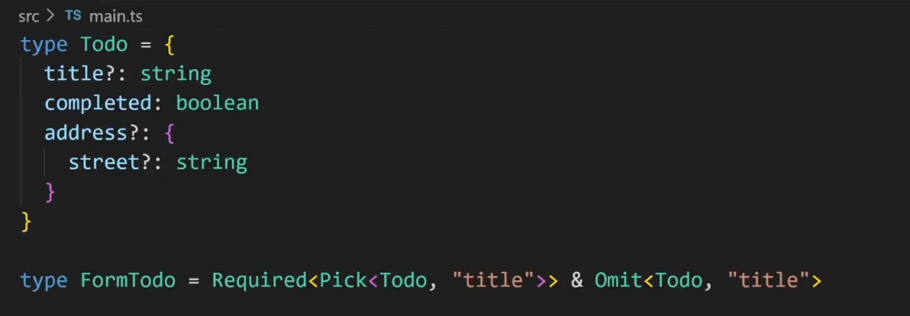
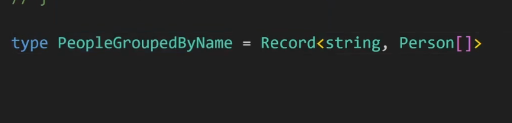
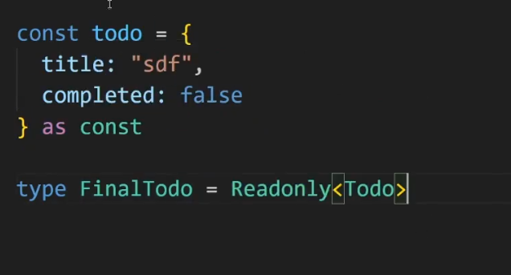

# 6 Feb

## Array Type

1. Nothing

## Any Type

1. Json.parse return any type
2. fetch request return any type
3. Don't use any it shuts down all the benefits of typescript

## Object Type

1. Here how we give types to object
   
2. How to add optional properties inside the object
   

## Types vs interfaces

1. We can give the reusable type 'Type' like this
   
2. Interface can only be used with objects
3. Here how we can define the interfaces
   

## Defining Functions

1. If we pass directly an object with extra properties then typescript will throw an error however if you pass it like this(attached) then typescript will not throw error because typescript care about structure only.
   

## Destructured and Rest Parameters

1. Here we can destructured the properties from the functions
   

2. Final output
   

3. Here how we used rest operator
   

## Typing Variables as function

1. This is how we defined function type when passed as arguments
   

# 7 Feb

## Unions

1. Here how can we define the unions
   
2. Some more example using unions
   

## Intersections

1. This is how we do intersections
   
2. This is how we do intersections with types
   

# 8 Feb

## Read Only

1. Here how we use read only on simple properties
   
2. This is how we can define read only on array
   

## KeyOF

1. This is how we use key of operator
   

## TypeOF

1. This is how we use typeof operator
   
2. People type will be dependent on person type

## Index type

1. This is initial code
   
2. We are duplicating the skill level in mutliple places.
3. We can extract out Skill level in new type but we can handle it differently.
4. Here is the way we can solve this
   
5. Here is another example
   

6. Here is another example. in this example we map over each element and return the type of element.
   

7. Here is another example
   

## As const and enums

1. Here we can use as const
   

## Tuples

1. This is how we define tuple
   

# 10 Feb

## Generics

1. document.querySelector returns a general element, to select the input element we have to provide type in angle brackets
   
2. Initial code example, problem is what happen if there is another array of boolean
   

3. To fix the above problem we can use it like this
   

4. Map Example
   

5. API response example
   

6. We can add blog data in our above example
   

7. Passing default values to generics
   

8. If we want to enforce generic types to an object
   

9. When we write `Tdata extends string or Tdata extends array` that means it should be a string or it should be array only
10. Write a function arrayto object in typescript

11. Solution
    

## Async Functions

1. Return type asynchronous function will always be a promise
   

2. Another example
   

## Pick and Omit

1. Omit example
   
2. Pick example
   

## Partial and Required

1. Partial makes all the fields optional
   

2. Required will make the fields as required
   

3. Required doesn't do deep nesting
   

4. In the below code, we are making the only the title as required property
   

5. We can reuse the required and partial like this
   

## Return types and parameters

1. Initial Code
   

2. They are both just to check parameters type and return type of a function
   

# 12 Feb

## Record

1. Initial code
   
2. We can use Record type to achieve the same results
   

## Read only

1. This is very similar to as const but we can use as const in javascript not in typescript
   

2. Read only is used when you want to create a new type from other type as read only
   

# 13 Feb

## Awaited

1. We can use this syntax like this. Awaited syntax just remove the promise.
   

2. More example
   

## Basic Type Guards

1. Initial code
   
2. Basic type guard example
   
3. We can also use instance of operator
   
4. we can use ?. operator if a type is undefined
5. If we know that form element will always be present then we can use ! operator like this
   
6. we can switch statement also
   

# 16 Feb

## Unknown type

1. Using unknown typescript will throw error so we need to narrow it down to check the type
   
